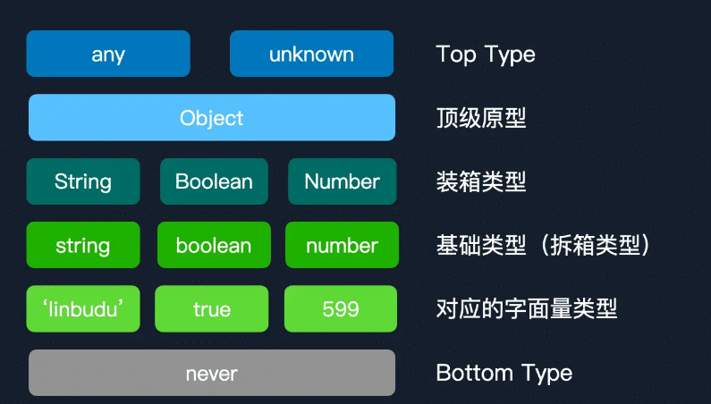

## declare

在 Ts 中使用 export 导出类型，函数时，需要使用 `declare` 定义声明文件，`declare` 可以告诉 Ts 编译器当前文件没有实现某些接口或类型，这些接口或类型是从外部引入的

## any, unknown, never

- any：表示任何类型，能被赋予任意类型的值
- unknown：表示一个未知类型，被赋值后，它的类型就确定了，除非进行类型断言，将其转换为其他类型
- never：表示那些永远不会存在值的类型

## Top Type 和 Bottom Type

- Top Type：指的是 any，它是任何类型的父类型，它可以存储任意类型的值，所以，它不会受类型检查器的约束
- Bottom Type：指 never，它无法被归类为其他类型，never 表示一种永远不会存在值的类型

// TODO 层级

## 类型层级

上面说了 Top Type 是 any，Bottom Type 是 never  
那么其他类型属于哪个层级呢?

- Top Type：any
- Object：与 any 一样，同样包含所有类型，但是与 Top Type 相比还是差了一层
- String, Boolean, Number：集装箱类型
- 原始类型与对象类型
- 字面量类型
- Bottom Type

```ts
type TypeChain = never extends "str"
  ? "str" extends "str" | "599"
    ? "str" | "599" extends string
      ? string extends String
        ? String extends Object
          ? Object extends any
            ? any extends unknown
              ? unknown extends any
                ? 8
                : 7
              : 6
            : 5
          : 4
        : 3
      : 2
    : 1
  : 0;
```



## 断言辅助实现对象

```ts
interface IStruct {
  foo: string;
  bar: {
    barPropA: string;
    barPropB: number;
    barMethod: () => void;
  };
}
// 1. 需要实现接口内全部内容
const objA: IStruct = {};
// 2. 无需实现接口内全部内容
const objB = <IStruct>{};
// 3. 无需实现全部内容
const objC = {} as IStruct;
```

## 索引签名类型

```ts
interface AllStringTypes {
  [key: string]: string;
}
```

## 索引类型查询

keyof 相当于获取了所有的键名

```ts
interface Foo {
  PropA: 1;
  599: 2;
}
type FooKeys = keyof Foo; // "PropA" | 599
// 但是在 vscode 中，上面的写法的悬浮提示为 keyof Foo
// 看不到实际的值，可以这么写
type FooKeys = keyof Foo & {};
```

## 泛型

```ts
// 下面这个例子会推导传入的 [] 为 never[]
arr.reduce((prev, cur, idx, arr) => {
  return [...prev, cur];
}, []);
// 所以需要泛型解决报错问题
arr.reduce<Array<number>>((prev, cur, idx, arr) => {
  return [...prev, cur];
}, []);
```

## 标称类型系统

我们拿下面的例子举例

```ts
type USD = number;
type CNY = number;
const CNYCount: CNY = 200;
const USDCount: USD = 200;
function addCNY(source: CNY, input: CNY) {
  return source + input;
}
addCNY(CNYCount, USDCount);
```

这段代码看上去没什么问题，但是仔细看就会发现，我们把人民币和美金相了，这是不对的，所以我们需要标称类型系统  
标称类型系统：两个可兼容的类型，它们的名字必须相同，也就是尽管两个变量存储的数据一样，但是它们的名字不一样，它们就是不一样的

```ts
export declare class TagProtector<T extends string> {
  protected __tag__: T;
}
export type Nominal<T, U extends string> = T & TagProtector<U>;
export type CNY = Nominal<number, "CNY">;
export type USD = Nominal<number, "USD">;
const CNYCount = 100 as CNY;
const USDCount = 100 as USD;
function addCNY(source: CNY, input: CNY) {
  return (source + input) as CNY;
}
// 不报错
addCNY(CNYCount, CNYCount);
// 报错
addCNY(CNYCount, USDCount);
```

## infer
infer 用于在条件类型中提取某一部分信息
```ts
type Func = (...args: any[]) => any;
type FunctionReturnType<T extends Func> = T extends (...args: any[]) => infer R
  ? R
  : any;
function foo(): string {
  return "foo";
}
type Res = FunctionReturnType<typeof foo>;
// ...
type Swap<T extends any[]> = T extends [infer A, infer B]
  ? [B, A]
  : T;
type Res = Swap<[1, 2]>;
```

